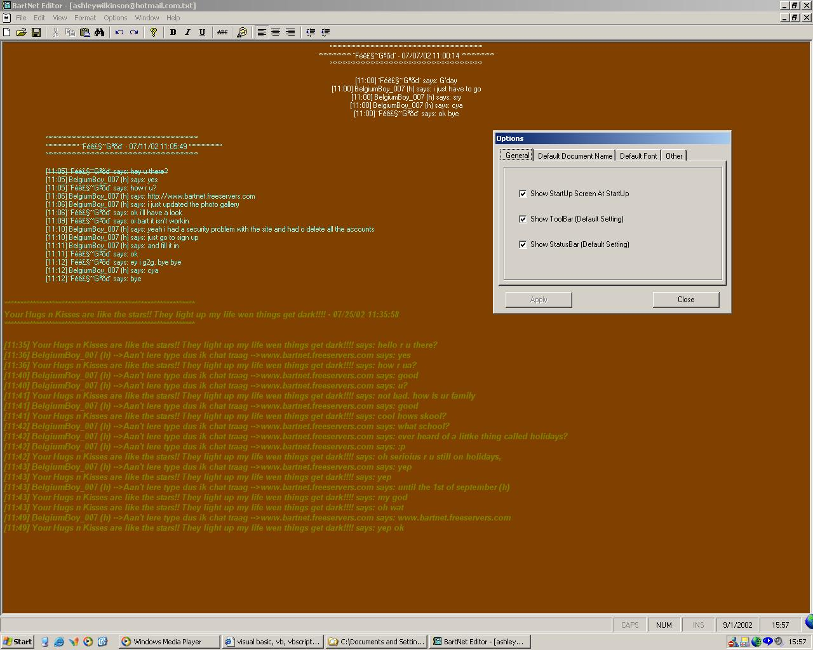



## \_\*\_BartNet Editor\_\*\_

### Description

This is my own personal version of microsoft word, using a rich testbox. It teaches u how to cut, copy, paste, undo, redo, search, increase\decrease indents, change allignment, and much, much more.

also uses commondialogbox and has the code to keep the search form on top. PLEASE VOTE.
 
### More Info
 
DO NOT DELETE ANY *.BartNet FILES. THEY ARE REQUIRED FOR THE PROGRAM TO WORK PROPERLY.

             |
---                |---
**Submitted On**   |2002-09-11 15:42:24
**By**             |[BelgiumBoy\_007](https://github.com/Planet-Source-Code/PSCIndex/blob/master/ByAuthor/belgiumboy-007.md)
**Level**          |Advanced
**User Rating**    |4.5 (50 globes from 11 users)
**Compatibility**  |VB 6\.0
**Category**       |[Complete Applications](https://github.com/Planet-Source-Code/PSCIndex/blob/master/ByCategory/complete-applications__1-27.md)
**World**          |[Visual Basic](https://github.com/Planet-Source-Code/PSCIndex/blob/master/ByWorld/visual-basic.md)
**Archive File**   |[\_\_\_BartNet1296759112002\.zip](https://github.com/Planet-Source-Code/belgiumboy-007-bartnet-editor__1-38560/archive/master.zip)

